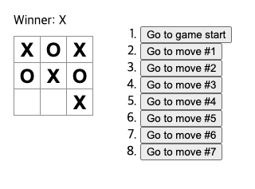

# 202130103 김민서
### 8주차(2025.04.18/5.1일 근로자의 날 보강)
### 한번 더 state 끌어올리기
- 다음 플레이어와 플레이 기록을 추적하기 위해 Game 컴포너느에 몇개의 state를 추가하세요.
```js
export default function Game() {
  const [xIsNext, setXIsNext] = useState(true);
  const [history, setHistory] = useState([Array(9).fill(null)]);
  // ...
```
- 현재 플레이에 대한 square를 랜더링하면 history에서 마지막 squares의 배열을 읽어야 합니다.
- 랜더링 중에 계산 할 수 있는 충분한 정보가 이미 있으므로 useState는 필요하지 않습니다.
```js
export default function Game() {
  const [xIsNext, setXIsNext] = useState(true);
  const [history, setHistory] = useState([Array(9).fill(null)]);
  const currentSquares = history[history.length - 1];
  // ...
```
- Board 컴포넌트가 props에 의해 완전히 제어되도록 만들겠습니다.
- Board 컴포넌트가 xIsNext, squares, onPlay 함수를 props로 받을 수 있도록 변경합니다.
- 다음으로 Board 함수에서 useState를 호출한느 처음 두 줄을 제거하겠습니다.
```js
function Board({ xIsNext, squares, onPlay }) {
  function handleClick(i) {
    //...
  }
  // ...
}
```
-  이제 Board 컴포넌트의 handleClick에 있는 setSquares 및 setXIsNext 호출을 새로운 onPlay 함수에 대한 단일 호출로 대체함으로써 사용자가 사각형을 클릭할 때 Game 컴포넌트가 Board를 업데이트 할 수 있습니다.
- 업데이트된 squares 배열을 새 히스토리 항목으로 추가하여 history 업데이트 해야 하고, Board에서 했던 것처럼 xIsNext 값을 반전 시켜야함
```js
export default function Game() {
  //...
  function handlePlay(nextSquares) {
    setHistory([...history, nextSquares]);
    setXIsNext(!xIsNext);
  }
  //...
}
```
- hisotroy 전개 구문으 사용하면 "history의 모든 항목 열거"로 읽을 수 있습니다.
- 이 시점에서 state를 Game 컴포넌트로 옮겼으므로 리펙터링 전과 마찬가지로 UI가 왖언히 작동해야함
### 과거 움직임 보여주기
- 이제 틱택토 게임의 히스토리를 기록하기 때문에, 플레이어에게 과거 플레이 목록을 보야줄 수 있습니다.
-React에서 여러 엘리먼트를 런더링하려면 React 엘리먼트 배열을 사용할 수 있습니다.
- JavaScript에서 한 배열을 다른 배열로 변환하려면 배열 map 메서드를 사용하면 됩니다.
```js
[1, 2, 3].map((x) => x * 2) // [2, 4, 6]
```
1. 플레이 history 배열을 화면의 버튼을 나타내는 React 엘리먼트로 변환 합니다.
2. 과거의 플레이로 "점프" 할 수 있는 버튼 목록을 표시하세요.
3. 이 것을 구현하기 위해서 Game 컴포넌트에서 history를 map을 이용해보겠습니다.

```js
export default function Game() {
  const [xIsNext, setXIsNext] = useState(true);
  const [history, setHistory] = useState([Array(9).fill(null)]);
  const currentSquares = history[history.length - 1];

  function handlePlay(nextSquares) {
    setHistory([...history, nextSquares]);
    setXIsNext(!xIsNext);
  }

  function jumpTo(nextMove) {
    // TODO
  }

  const moves = history.map((squares, move) => {
    let description; ㅁ ㅍ
    if (move > 0) {
      description = 'Go to move #' + move;
    } else {
      description = 'Go to game start';
    }
    return (
      <li>
        <button onClick={() => jumpTo(move)}>{description}</button>
      </li>
    );
  });

  return (
    <div className="game">
      <div className="game-board">
        <Board xIsNext={xIsNext} squares={currentSquares} onPlay={handlePlay} />
      </div>
      <div className="game-info">
        <ol>{moves}</ol>
      </div>
    </div>
  );
}

```

## 문서의 내용 이해하기 어렵게 번역되어 있어 다시 정리
- map 기본 구문은 map(callbackFn)혹은 map(callbackFn,thisArg) 입니다. 
-thisArgs는 내부에서 this로 사용할 값을 지정하는데 화살표 함수에서는 생략된다.
- map함수는 history 각각의 요소 index를 순회하면서 squares 추출합니다. 각 요소는 { }안의 살향뮨울 살행하면서 버튼을 생성합니다.
- 이렇게 생성된 버튼은 moves 객체에 다시 저장됩니다.
- move 최종 rendering에 사용됩니다.

### key 선택하기
- 만약 데이터베이스에서 데이터를 불러와서 사용한다면  Alexa, Ben, Claudia의 데이터베이스 ID를 key로 사용할 수 있습니다.
```js
<li key={user.id}>
  {user.name}: {user.taskCount} tasks left
</li>
```
- 리스트가 다시 렌더링 되면 React는 각 리스트 항목의 key를 가져와서 이전 리스트의 항목에서 일치하는 key를 탐색합니다.
### 시간 여행 구현하기 - 1
- 틱택토 게임의 기록에서 과거의 각 플레이에는 해당 플레이의 일련번호인 고유 ID가 있습니다.
- 플레이는 중간에 순서를 바꾸거나 삭제하거나 삽입할 수 없기 때문에 플레이 인덱스를  key로 사용하는 것이 안전합니다.

1. 
```js
const moves = history.map((squares, move) => {
  //...
  return (
    <li key={move}>
      <button onClick={() => jumpTo(move)}>{description}</button>
    </li>
  );
});
```
### 시간여행 구현하기 - 2
- jumoTo 구현하기 전에 사용자가 현재 어떤 단계를 보고 있는지를 추적할 수 있는 Game컴포넌트의 state 하나 더 필요합니다.

1. 이를 위해 초기값이 0인 currentMove 라는 새 state 변수를 정의
```js
export default function Game() {
  const [xIsNext, setXIsNext] = useState(true);
  const [history, setHistory] = useState([Array(9).fill(null)]);
  const [currentMove, setCurrentMove] = useState(0);
  const currentSquares = history[history.length - 1];
  //...
}
```
2.Game 내부의 jumpTo 함수를 업데이트 하여 해당 currentMove를 업데이트 하세요

3. "시간을 거술러 올라가서" 그 시점에서 새로운 이동을 하는 경우 해당 시점까지 히스토리만 유지해야 합니다. 
```js
function handlePlay(nextSquares) {
  const nextHistory = [...history.slice(0, currentMove + 1), nextSquares];
  setHistory(nextHistory);
  setCurrentMove(nextHistory.length - 1);
  setXIsNext(!xIsNext);
}

```
4. 항상 마지막 동작을 랜더링하는 대신 현재 선택한 동작을 랜더링하도록 Game 컴포넌트를 수정하겠습니다.
```js
export default function Game() {
  const [xIsNext, setXIsNext] = useState(true);
  const [history, setHistory] = useState([Array(9).fill(null)]);
  const [currentMove, setCurrentMove] = useState(0);
  const currentSquares = history[currentMove];

  // ...
}
```
5. 게임 히스토리의 특정 단계를 클릭하면 틱택토 보드가 즉시 업데이트 되어 아래 사진과 같이 해당 단계가 발생한 시점의 보드 모양이 표시 됩니다.


### 7주차(2025.04.17)
### state 끌어올리기
- handClick 함수는 javascript의 slice() 배열 메서드를 사용하여 squares 배열 메서드를 사용하여 squares 배열의 사본인 nextSquares 생성합니다.
- 그 다음 handleClick 함수는 nextSquares 배열의 첫 번째 Squares(index [0])에 X를 추가하여 업데이트 
- setSquares 함수를 호출하면 React는 컴포넌트(Board)와 그 하위 컴포넌트(보드를 구성하는 Square 컴포넌트)가 다시 랜더링 됩니다.
- 그러면 squares의 static를 사용하는 컴포넌트(board)와 그하위 컴포넌트(보드를 구성하는 Square 컴포넌트) 가 다시 랜더링 됩니다.<br>
** 중요 ** 
- 이 설명은 문서의 코드 중 board가 Square를 포함하고 있음을 전제

### #Closure의 개념
- 클로저의 핵심은 스코프를 이용하여 변수의 접근 범위를 '폐쇄'하는 것이 있다.
- 외부 함수 스코프에 
- 사용자 정의 컴포넌트, 예를 들어 square의 경우 이름은 사용자가 원하는 대로 지을수 있음

### State 끌어올리기
- Square의 onSquareClick prop나 Board의 handleClick

### 불변성이 왜 중요할까요
- 데이터의 변경 여부를 저렴한 비용으로 판단할 수 있다.

### 교대로 두기 -1(차례를 지키다)
- 현재까지 작성한 틱택토 게임에서 가장 큰 결함인 "0"을 보드에 표시할 수 없다는 문제를 수정할 차례입니다.
1. 첫번째 선수가 두는 말을 "X"로 설정합니다. 이제 Board 컴포넌트에 또 다른 state를 추가하여 추적해 보겠습니다.
-  X와 0가 번갈아 한 번씩 두어야 하기 때문에 X가 두었는지 아닌지 현재의 상태를 보관하면 됩니다.
즉, X의 차례면 true, 0의 차례면 false 상태로 기억하면 됩니다.
```js
Function Board() {
  const [xIsNext, setXIsNext] = useState(true);
  const [squares, setSquares] = useState(Array(9).fill(null));

  // ...
}
```
- 완성된 코드는 다음과 같습니다.
```js
export default function Board() {
  const [xIsNext, setXIsNext] = useState(true);
  const [squares, setSquares] = useState(Array(9).fill(null));

  function handleClick(i) {
    const nextSquares = squares.slice();
    if (xIsNext) {
      nextSquares[i] = "X";
    } else {
      nextSquares[i] = "O";
    }
    setSquares(nextSquares);
    setXIsNext(!xIsNext);
  }

  return (
    //...
  );
}
```
### 교대로 두기 - 2
- 이제 다른 사각형을 클릭하면 정상적으로 X와 0가 번갈아 표시합니다.
- 지금은 X의 0로 사각형을 표시할 때 먼저 해당 사각형에 이미 x 또는 0 값이 있는지 확인하고 있지 않습니다.
- square가 이미 채워져 있는 경우 Board의 state를 업데이트 하기 전에 handClick 함수에서 초기에 return 하겠습니다.
```js
function handleClick(i) {
  if (squares[i]) {
    return;
  }
  const nextSquares = squares.slice();
  //...
}
```
### 우승자 선언
- 이제 플레이어들이 차례를 지낼수 있게 되었으니, 게임이 승리하고 더이상 차례가 없을 때를 표시해야합니다.
- 이를 위해 calculateWinner 9개의 사각형 배열을 받아서 승자를 확인하고, 필요에 따라 'X', 'O', 또는 null을 반환하는 도우미 함수를 추가합니다.
```js
export default function Board() {
  //...
}

function calculateWinner(squares) {
  const lines = [
    [0, 1, 2],
    [3, 4, 5],
    [6, 7, 8],
    [0, 3, 6],
    [1, 4, 7],
    [2, 5, 8],
    [0, 4, 8],
    [2, 4, 6]
  ];
  for (let i = 0; i < lines.length; i++) {
    const [a, b, c] = lines[i];
    if (squares[a] && squares[a] === squares[b] && squares[a] === squares[c]) {
      return squares[a];
    }
  }
  return null;
}
```
### 구조 분해 할당(Destrcturing Assignment)
- 비구조 할당, 구조화 할당이라고도 번역되지만 구조 분해 할당을 많이 사용함
- 구조 분해 할당은 배열이아 객체의 구조를 해체하여 내부 값을 개별 변수에 쉽게 할당하는 변수 입니다.
### 승자 결정하기 -1

 ### 6주차
 ### props를 통해 데이터 전달하기
 - React의 componet architecture 사용해서 재사용할 수 있는 component를 만들고 지저분하고 중복된 코드를 삭제
 - Board component를 만들고, Square component의 내용를 복사합니다
 - Square componet의 button을 하나만 남기고 모두 삭세합니다.
 - App에서 호출하는 component를 Square에서 Board로 바꿔줍니다.
 - 정상적으로 출력이 되는지 확인

 ---
 - 여기까지는 숫자 1만 나오게 되는중입니다.
 - 이 문제를 해결하기 위해서는 props를 사용하여 각 사각형이 가져야 할 값을 부모 component(Board)에서 자식 component(Square)로 전달 합니다.
 - component를 호출하는 쪽이 부모 component 입니다.
 
 ### ### props를 통해 데이터 전달하기2
 - Square component를 value prop을 전달 받을 수 있도록 수정합니다.
 ``` 
 function Square({ value }) {
  return <button className="square">1</button>;
}
```
- 

 ### 사용자와 상호작용하는 컴포넌트 만들기

 ### component 분리하기

 ### 5주차 
 ### 화면 업데이트 하기
 - useState로부터 현재의 state를 저장할 수 있는 변수이니 count와 이를 업데이트 할 수 있는 SetCount를 얻을 수 있습니다.
 ### Hoook 사용하기
 - use로 시작하는 함수를 Hook이라고 합니다.
 - useState는 React에서 제공하는 내장 Hook입니다.
 ### Hooks의 사용 규칙
 1. 최상위에서만 호출해야한다.
 - check point = if, for while 등의 블록 내부에서 Hooks를 호출하면 안됩니다.
 - check point = 함수의 조건문 내부에서 호출하면 실행 순서가 달라질 수 있기 떄문입니다.
 ### Hooks의 사용 규칙
 1. readering 순서를 보장 하기 위해
 2. 불필요한 사이드 이펙트 방지
 ### 왜 function형 컴포넌트에서만 Hook를 사용할 까?
 - Class형 component는 lifecycle 함수를 통해서 상태 관리를 했습니다.
 ### function component vs class conponent
 - 왜 요즘은 function형 component를 주로 사용할까 라는 의문을 갖는 경우가 많습니다.
 - React 초장기에는 함수형 컴포넌트는 존재했지만, 단순히 props를 받아 UI를 반환하는 역할만 가능했다.
 -
 -
 ### component 간 데이터 공유
 - 공식 문서의 경유 Mybutoon, MyApp의 js 파일을 수정하면서 설명하고 있어서 이전 상태를 확인하기 어렵다.
 - 물론 commit을 꼼꼼히 commit을 해두면 ckeckout 을 통해서 확인이 가능합니다.(단 이경우 ckeckout을 반복해야 하기 때문에 확인하는데 불편합니다.)

- randering'
### 보드 만들기
- fragment Tag나 division Tag를 사용해서 wrapping 해 주기
- bu
## 2025.03.27 4주차(실습 시작)

### 오늘의 학습 내용

1. 컴포넌트를 만들고 중첩하는 방법
2. 마크업과 스타일을 추가하는 방법
3. 데이터를 표시하는 방법
4. 조건과 리스트를 렌더링하는 방법

### Brain Stoming

- MyApp이라는 함수형 component를 생성
- 먼저 무엇부터 해야할지 생각해 보세요

### 컴포넌트 생성 및 중첩하기
- React 앱은 컴포넌트로 구성됩니다. **컴포넌트**는 고유한 로직과 모양을 UI의 일부입니다. 
### UI 란?
- 기계와 사람과의 의사소통을 위해 영구적, 일시적인 접근 가능하게 해주는 물리적 가상적 매개체
- (*매개체 : 중간에서 어떤 일을 이어주는 것)
- 컴포넌트는 버튼만큼 작을 수도 있고 전체 페이지만큼 클 수도 있습니다.
- React 컴포넌트는 마크업을 반환하는 자바스크립트 함수
```js
function Mybutton(){
  return (
    <button>I'm a button</button>
  )
}
```


### 3. JSX로 마크업 작성하기

1. 어떤 디렉토리에 파일을 만들지?
2. 파일 이름은 뭐라고 할지?
3. 함수는 어떻게 구상할지?

- 구현 해보기

### Component의 생성 및 nesting(중첩)

- export default와 export의 차이
  Named Exports
- 하나의 파일안에 여러개의 component가 있을때 사용(component의 정확한 이름을 명시 해야함)
  Default Exports

### 3. JSX로 마크업 작성하기

- JSX는 HTML보다 더욱 엄격한 문법을 적용
- JSX에서는 싱글 태그라도 닫아야 한다.(/br)
- <></> 빈 래퍼와 같이 공유되는 부모로 감싸야함

### 5. 데이터 표시하기

- 중괄호를 사용하면 코드에서 일부 변수를 삽입하여 사용자에게 표시할 수 있도록 자바스크립트로 "이스케이프 백" 할수 있습니다.<br>
- JSX 어트리뷰트에서 따옴표 대신 중괄호를 사용하여 “자바스크립트로 이스케이프(Escape Into JavaScript)” 할 수도 있습니다.

### 6. 조건부 랜더링

- React에서 조건문을 작성하는 데에는 특별한 문법이 필요 없습니다. 일반적인 자바스크립트 코드를 작성할 때 사용하는 것과 동일한 방법을 사용합니다.

## 2025.03.20 3주차

## React 의존성 관리

## 2025.03.20 3주차

## React 의존성 관리
- src/ - 프로젝트 주요 코드가 위치하는 디렉토리
- src/App.js - 메인 component로 필요한 sub component를 모아서 관리, 출력을 위해서 index.js로 전달됨
- src/App.css - App.js에 적용되는 스타일을 정의하는 스타일 파일
- src/index.js - React 앱의 진입점으로 최종 랜더링 되는 곳
- src/index.css - 전역 스타일을 정의하는 스타일 파일
<<<<<<< HEAD

## 의존성 관리와 pakage.json

- pakage.json 패키지의 의존성을 관리하는 파일이다.

## node module의 재설치

1. node modules 폴더와 packge-lock.json 파일 삭제하기 (bash : rm -rf node modules pakage-lock.json)
2. npm 패키지의 임시 저장소인 cashe를 초기화 하기

- force 옵션으로 강제 삭제 (npm cacje clean --force)
  \*\* 일반적으로 캐시 정리x, 단 의존성 문제가 계속 된다면 실행하는 것이 좋다.

3. 패키지 재설치
   (npm install)

## 3장

- React는 component 단위로 개발하여 레고를 조립하듯이 앱을 완성
- React component가 어떻게 웹페이지로 바뀌는지 중점으로 보는 것이 좋다.

### 3.2

### Component를 사용한 유저 인터페이스 생성

- JSX는 React를 통해 대중화된 JavaScript 확장문법이다.

### 필요한 곳에 상호작용 기능 추가

- React component는 데이터를 수신
- 사용자의 입력을 받아 새로운 데이터를 component에 전달

### 5. full-stack App 개발을 도와주는 React Framewrork

- React로 전체 앱을 빌드하려면 Next.js 또는 Remix와 같은 full-stack React Framework을 사용하느 것이 좋습니다.

### 6. 모든 플랫폼에서 최고의 성능을 발휘하는 React

- 웹 앱과 네이티브 앱을 모두 구축할 수 있다.
- 웹의 본질
  - 서버에서 데이터를 가져오는 동안에도 HTML을 스트리밍을 시작할수 있다.
  - JavaScript 코드가 로드되기 전에 콘텐츠르르 점진적으로 채울수 있다.
  - 클라이언트 측에서는 표준 웹 API를 사용해서, 랜더링 도중에도 UI를 반응하도록 할 수 있습니다.

=======
## 의존성 관리와 pakage.json
- pakage.json 패키지의 의존성을 관리하는 파일이다.
## node module의 재설치
1. node modules 폴더와 packge-lock.json 파일 삭제하기 (bash : rm -rf node modules pakage-lock.json)
2. npm 패키지의 임시 저장소인 cashe를 초기화 하기
- force 옵션으로 강제 삭제 (npm cacje clean --force)
** 일반적으로 캐시 정리x, 단 의존성 문제가 계속 된다면 실행하는 것이 좋다.
3. 패키지 재설치
(npm install)

## 3장
- React는 component 단위로 개발하여 레고를 조립하듯이 앱을 완성
- React component가 어떻게 웹페이지로 바뀌는지 중점으로 보는 것이 좋다.
### 3.2
### Component를 사용한 유저 인터페이스 생성
- JSX는 React를 통해 대중화된 JavaScript 확장문법이다.
### 필요한 곳에 상호작용 기능 추가
- React component는 데이터를 수신
- 사용자의 입력을 받아 새로운 데이터를 component에 전달
### 5. full-stack App 개발을 도와주는 React Framewrork
- React로 전체 앱을 빌드하려면 Next.js 또는 Remix와 같은 full-stack React Framework을 사용하느 것이 좋습니다.
### 6. 모든 플랫폼에서 최고의 성능을 발휘하는 React
- 웹 앱과 네이티브 앱을 모두 구축할 수 있다.
- 웹의 본질
    - 서버에서 데이터를 가져오는 동안에도 HTML을 스트리밍을 시작할수 있다.
    - JavaScript 코드가 로드되기 전에 콘텐츠르르 점진적으로 채울수 있다.
    - 클라이언트 측에서는 표준 웹 API를 사용해서, 랜더링 도중에도 UI를 반응하도록 할 수 있습니다.

# 2025.03.13(2주차)

### Node.js 어디에 활용 되는가?

- 웹 서버 (Next.js,Express.js)-> REST API
- 실시간 애플리케이션 (Soket.io)-> 채팅 실시간 알림 스트리밍
- 서버리스(Serverless)환경 -> AWS Lambda 같은 FaaS

### node.js가 인기를 끄는 이유

- JavaScriipt 풀스택 개발 :프론트 엔드와 벡엔드를 같은 언어로 개발 가능

장점 : npm의 방대한 생태계를 활용가능
실시간 데이터 처리(WebSocket)가 강력함

버전 관리는 빠르면 1년에 한번 늦으면 1년에서 1년 반정도 걸린다고 한다.React도
2024년 12월 5일에 19.0.0출시되고 변경 없다

React 공식 사이트에서 기초로 사용
(컴퍼넌트를 많이 사용함 java의 클래스 처럼)
<<<<<<< HEAD
react는 codesandbox.io에서 이해를 도와줌,
=======
react는 codesandbox.io에서 이해를 도와줌, 

